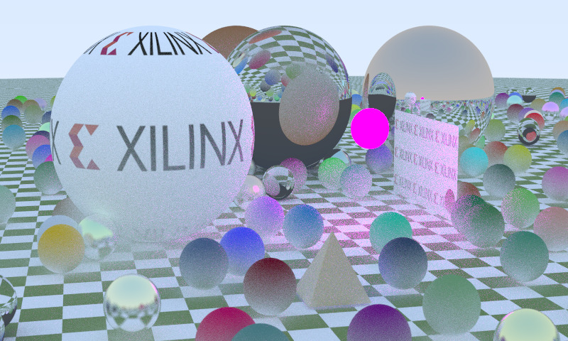

## RAY TRACER

Clone the reposity with:
```sh
git clone https://gitenterprise.xilinx.com/kranipet/Ray_Tracer.git
```
### Compiling with CMake

Create a `build` directory inside the cloned repo and jump into it.
From there, run:
```sh
cmake .. -DCMAKE_MODULE_PATH=.../triSYCL/cmake
```
Build the project with:
```sh
cmake --build .
```
This creates the executable . Now you can run the SYCL version of Ray Tracer with::
```sh
time RT_SYCL/sycl-rt >! result.ppm
```
This results in the image ``result.ppm`` produced by the Ray Tracer.



The following are the references that were tremendously useful in writing this project:

1. [Ray Tracing in One Weekend - Peter Shirley](https://raytracing.github.io/books/RayTracingInOneWeekend.html
)

    [Ray Tracing: The Next Week - Peter Shirley](https://raytracing.github.io/books/RayTracingTheNextWeek.html
)
2. [Ray-tracing in a Weekend with SYCL - Part 1](https://www.codeplay.com/portal/blogs/2020/05/19/ray-tracing-in-a-weekend-with-sycl-basic-sphere-tracing.html)

    [Ray-tracing in a Weekend with SYCL - Part 2](https://www.codeplay.com/portal/blogs/2020/06/19/ray-tracing-in-a-weekend-with-sycl-part-2-pixel-sampling-and-material-tracing.html)

3. [CppCon 2018: Mateusz Pusz “Effective replacement of dynamic polymorphism with std::variant”](https://www.youtube.com/watch?v=gKbORJtnVu8)
4. [Runtime Polymorphism with std::variant and std::visit - Bartek](https://www.bfilipek.com/2020/04/variant-virtual-polymorphism.html)
5. [http://geomalgorithms.com/a06-_intersect-2.html](http://geomalgorithms.com/a06-_intersect-2.html)
